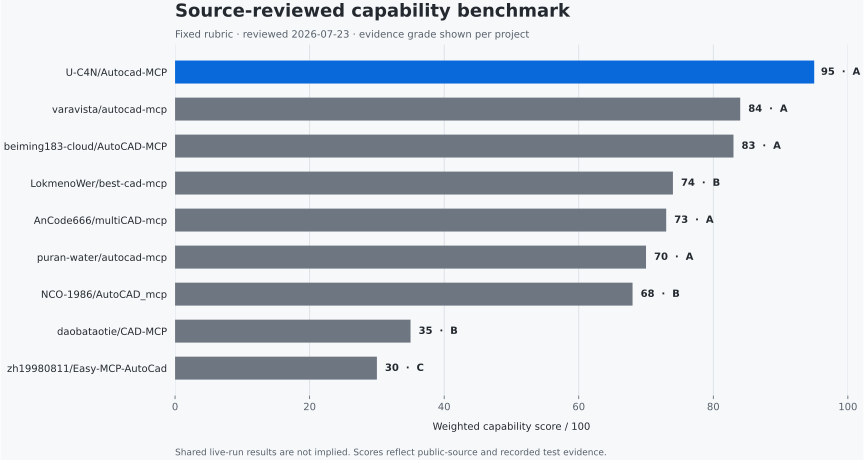
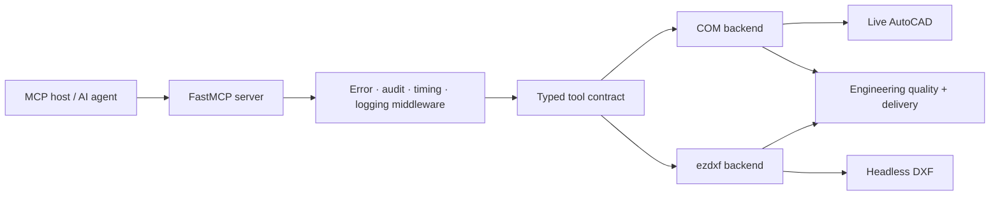

# AutoCAD MCP Pro

Production-grade AutoCAD automation for AI agents—live through COM on Windows,
or headless through ezdxf on any platform.

[](LICENSE)
[](pyproject.toml)
[](https://github.com/jlowin/fastmcp)
[](https://github.com/U-C4N/Autocad-MCP/stargazers)

One typed MCP contract controls two execution engines. Build and edit drawings,
query exact geometry, apply engineering standards, refine quality issues inside
transactions, and deliver hashed artifacts with validation evidence.

> **v1.3 release snapshot:** 122 tools · 6 resources · 5 prompt templates ·
> 406 collected tests. Runtime discovery through `system_about` is authoritative.

## Start in 60 seconds

```bash
git clone https://github.com/U-C4N/Autocad-MCP.git
cd Autocad-MCP
python -m venv .venv
```

Activate the environment and start the stdio server:

```powershell
# Windows
.venv\Scripts\Activate.ps1
pip install -e .
python server.py
```

```bash
# macOS / Linux
source .venv/bin/activate
pip install -e .
python server.py
```

That starts the headless-capable server with automatic backend selection. For
live AutoCAD control on Windows:

```powershell
pip install -e ".[com]"
$env:AUTOCAD_MCP_BACKEND = "com"
python server.py
```

No AutoCAD installation is needed for the ezdxf backend:

```powershell
$env:AUTOCAD_MCP_BACKEND = "ezdxf"
python server.py
```

## Evidence, not adjectives



The graphic is generated with Matplotlib from
[`benchmarks/source_review.json`](benchmarks/source_review.json). A fixed,
public 100-point rubric covers functional CAD breadth, correctness and delivery,
backend reach, engineering production, tests, and security.

| Project | Score | Evidence |
|---|---:|:---:|
| **[U-C4N/Autocad-MCP](https://github.com/U-C4N/Autocad-MCP)** | **93** | A |
| [varavista/autocad-mcp](https://github.com/varavista/autocad-mcp) | 84 | A |
| [beiming183-cloud/AutoCAD-MCP](https://github.com/beiming183-cloud/AutoCAD-MCP) | 83 | A |
| [AnCode666/multiCAD-mcp](https://github.com/AnCode666/multiCAD-mcp) | 73 | A |
| [puran-water/autocad-mcp](https://github.com/puran-water/autocad-mcp) | 70 | A |
| [NCO-1986/AutoCAD_mcp](https://github.com/NCO-1986/AutoCAD_mcp) | 68 | B |

This is a dated source review—not a claim that every project completed a shared
live AutoCAD run. Evidence grade **A** means source plus executable local
evidence was reviewed; **B** means source and tool surface were reviewed but the
live AutoCAD path was not fully executed.

Reproduce the chart and run the ten-task reference adapter:

```bash
pip install -e ".[pdf]"
python -m benchmarks.render_chart
python -m benchmarks.run_competitors --server autocad-mcp-pro --backend ezdxf --json
```

Cross-project runtime scores will be published only after equivalent adapters
execute the same task contract. The complete rubric, caveats, version A/B suite,
and reproduction commands live in [`benchmarks/`](benchmarks/README.md).

## Why this architecture holds up

### One contract, two engines

The COM backend controls a live AutoCAD session on Windows through a
single-threaded STA executor. The ezdxf backend creates, edits, renders, and
validates DXF drawings without AutoCAD. Both return the same typed entities,
layers, blocks, drawing metadata, and capability format.

### Geometry agents do not have to guess

Tools such as `point_from_snap`, `point_intersection`, and `point_tangent`
resolve exact construction coordinates from drawing entities. Handle-preserving
edit tools and smart selection keep agents attached to real geometry instead of
reconstructing state from prose.

### Quality is a loop

`drawing_preflight` checks whether an engineering request is ready to draw.
`drawing_critique` reports standards and geometry issues. `drawing_refine`
repairs the supported subset inside isolated transactions and rolls back rounds
that reduce quality. `drawing_finalize` combines structural validation,
standards critique, a scalar score, and invalidity ratio.

### Delivery carries evidence

`drawing_deliver` creates the requested artifacts, computes SHA-256 hashes,
reopens the canonical DXF, compares entity/layer/type counts and bounds, and
writes `manifest.json` plus `validation.json`. A successful tool call is not
treated as proof that the drawing survived export.

## Backend capabilities

| Capability | COM backend | ezdxf backend |
|---|:---:|:---:|
| Live AutoCAD document control | ✓ | — |
| Headless DXF creation and editing | — | ✓ |
| Cross-platform execution | — | ✓ |
| Deterministic entity/query contract | ✓ | ✓ |
| Transactions and rollback | ✓ | ✓ |
| TABLE and MLEADER semantics | Native | Portable composite |
| Screenshots | AutoCAD window | Matplotlib render |
| Raw AutoCAD commands / AutoLISP | Opt-in | — |

Use `system_capabilities` at runtime instead of assuming backend support. The
machine-readable response distinguishes `native`, `composite`, `emulated`, and
`unsupported` behavior where the engines differ.

## A production drawing workflow

The server exposes low-level CAD primitives, but the intended engineering path
uses deterministic orchestration and validation:

```text
drawing_preflight → drawing_plan → drawing_apply_iso_layers
→ deterministic create/edit tools → dimension_auto
→ drawing_critique → drawing_refine
→ drawing_finalize → drawing_deliver
```

Representative capability groups include:

| Area | Examples |
|---|---|
| Drawing lifecycle | create, open, save, export, audit, purge, undo/redo |
| Geometry | lines, arcs, polylines, hatches, splines, trim/extend/fillet/chamfer |
| Annotation | dimensions, ISO 129 tolerances, TABLE, MLEADER, text editing |
| Engineering | gears, keyed bores, title blocks, ISO 1101 GD&T and datums |
| Query | entity/layer/block inspection, selection, bounds, distance and area |
| Quality | preflight, critique, score, transactional refinement and finalization |
| Delivery | PDF/PNG/DXF output, hashes, manifests and reopen-parity checks |

The tool surface evolves. Ask `system_about` for the live grouped inventory
instead of building integrations around a copied list from this README.

## Installation profiles

| Profile | Command | Use case |
|---|---|---|
| Core | `pip install -e .` | Headless ezdxf workflows |
| COM | `pip install -e ".[com]"` | Live AutoCAD on Windows |
| PDF | `pip install -e ".[pdf]"` | PDF export and headless screenshots |
| Full | `pip install -e ".[full]"` | Both backends and all render features |

Requirements:

- Python 3.11+
- [FastMCP](https://github.com/jlowin/fastmcp) 3.0+
- [ezdxf](https://github.com/mozman/ezdxf) 1.3+
- AutoCAD, `pywin32`, and Pillow only for live COM control
- Matplotlib only for PDF/headless rendering and benchmark visualization

## Connect an MCP client

### Claude Desktop

Add a server entry to `claude_desktop_config.json` and use the absolute path to
your checkout:

```json
{
  "mcpServers": {
    "autocad": {
      "command": "python",
      "args": ["C:\\path\\to\\Autocad-MCP\\server.py"],
      "env": {
        "AUTOCAD_MCP_BACKEND": "auto",
        "ALLOWED_PATHS": "C:\\Users\\you\\Documents\\AutoCAD"
      }
    }
  }
}
```

Cursor, Cline, Continue, Goose, and other stdio-capable MCP hosts use the same
`command` plus `args` shape. The model vendor is not part of the server
contract.

### Local HTTP

```bash
fastmcp run server.py:mcp --transport http --port 8000
```

Loopback is the default. A non-loopback bind is refused unless remote HTTP is
explicitly enabled and bearer-token authentication is configured.

## Configuration

Set variables in your shell, process manager, or MCP client configuration.
[`.env.example`](.env.example) is a reference; the server reads process
environment variables directly.

| Variable | Default | Purpose |
|---|---|---|
| `AUTOCAD_MCP_BACKEND` | `auto` | Select `auto`, `com`, or `ezdxf` |
| `LOG_LEVEL` | `INFO` | Python logging level |
| `ALLOWED_PATHS` | empty | Comma-separated absolute paths the server may access |
| `MAX_UNDO_STACK` | `5` | Maximum retained undo snapshots |
| `MAX_DXF_BYTES` | `52428800` | Reject larger DXF input; `0` disables the check |
| `MAX_LIST_LIMIT` | `5000` | Bound list and selection response sizes |
| `COM_CALL_TIMEOUT` | `60` | Per-call live AutoCAD timeout in seconds |
| `DANGEROUS_COMMANDS_ENABLED` | `false` | Allow blocked commands/LISP and report unsafe mode |
| `ALLOW_REMOTE_HTTP` | `false` | Permit a non-loopback HTTP bind |
| `MCP_AUTH_TOKEN` | empty | Bearer token required for remote HTTP |

Backend selection:

| Value | Behavior |
|---|---|
| `auto` | Try COM on Windows, then fall back to ezdxf |
| `com` | Require a reachable live AutoCAD instance |
| `ezdxf` | Force portable, headless DXF operation |

## Architecture



- `server.py` owns the FastMCP surface, lifespan, middleware, resources, and
  prompt templates.
- `backends/base.py` defines the shared contract and capability model.
- `backends/com_backend.py` serializes COM calls through one STA thread with
  per-call timeouts.
- `backends/ezdxf_backend.py` wraps synchronous DXF work with
  `asyncio.to_thread` and snapshot-based transactions.
- `engineering/` contains standards-aware planning, drawing, critique, scoring,
  refinement, validation, and delivery.
- `security.py` centralizes path validation and command/LISP sanitization.

## Security model

The server treats tool input as untrusted:

- Every file path passes through traversal and allowed-root validation.
- Dangerous AutoCAD commands and AutoLISP channels are blocked by default.
- Remote HTTP requires explicit opt-in and a bearer token.
- DXF size, query-result size, undo history, and COM call duration are bounded.
- Audit middleware records tool timing and failures.
- `system_status` and `system_about` expose `unsafe_mode` when dangerous
  operations are enabled.

`DANGEROUS_COMMANDS_ENABLED=true` is a trust decision, not an installation
shortcut. Keep it disabled for agents or clients you do not fully control.

Please avoid filing public issues for vulnerabilities. Contact the maintainer
through [GitHub](https://github.com/U-C4N) first.

## Development

```bash
pip install -e ".[full]"
pip install pytest pytest-asyncio pytest-cov ruff build
python -m pytest
python -m ruff check .
python -m ruff format --check .
python -m build
```

Focused benchmark checks:

```bash
python -m pytest tests/test_benchmark_chart.py tests/test_benchmark_v2.py -q
python -m benchmarks.render_chart
```

Repository map:

```text
server.py                 FastMCP surface and orchestration
config.py                 Environment-driven settings
security.py               Path, command, and AutoLISP guards
version.py                Canonical package version
backends/                 COM and ezdxf implementations
engineering/              Standards, critique, refinement, delivery
benchmarks/               Reproducible data, runners, and reports
tests/                    Headless, mocked-COM, contract, and security tests
```

## Roadmap

The next priorities are capability-aware tool discovery, paper-space/layout
depth, ISO 286 fits, Windows CI coverage, opt-in COM 3D solids, and real
cross-project runtime adapters. Features are published when their contracts and
limitations are testable—not when they make a longer checklist.

## Contributing

Pull requests are welcome, especially for reproducible competitor adapters,
mocked/live COM coverage, engineering standards, and backend parity. For a
large change, open an issue first so the tool contract and evidence plan can be
agreed before implementation.

## Author

**Umutcan Edizsalan** · Mechanical engineering work at **Anka-Makine** ·
GitHub [@U-C4N](https://github.com/U-C4N)

Built from production drawing work, then made model-agnostic through MCP.

## License

[MIT](LICENSE)
