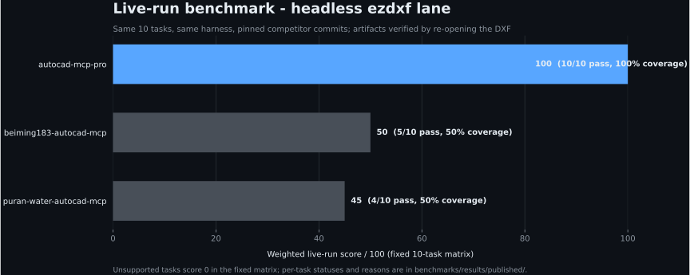
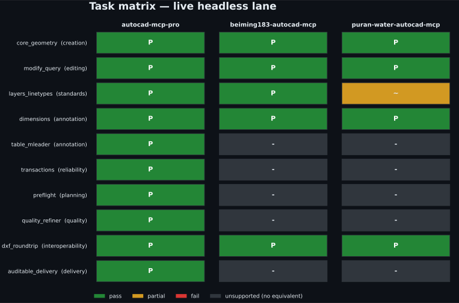
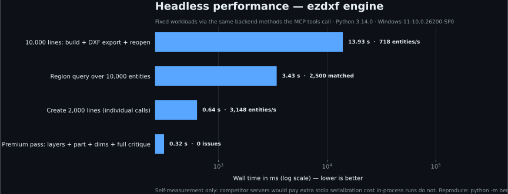
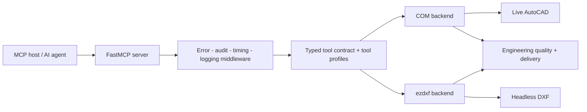

# AutoCAD MCP Pro

Production-grade AutoCAD automation for AI agents — live through COM on
Windows, or headless through ezdxf on any platform.

[](https://github.com/U-C4N/Autocad-MCP/actions/workflows/ci.yml)
[](https://pypi.org/project/autocad-mcp-pro/)
[](LICENSE)
[](pyproject.toml)
[](https://github.com/jlowin/fastmcp)
[](https://github.com/U-C4N/Autocad-MCP/stargazers)

One typed MCP contract controls two execution engines. Build and edit drawings,
query exact geometry, apply engineering standards (ISO 128/129/286/1101),
refine quality issues inside transactions, and deliver hashed artifacts with
validation evidence.

> **v1.4 release snapshot:** 131 tools · 6 resources · 5 prompt templates ·
> 474 collected tests. Runtime discovery through `system_about` is authoritative.

## Install in 10 seconds

```bash
pip install autocad-mcp-pro     # or: uvx autocad-mcp-pro
autocad-mcp                     # stdio MCP server, backend auto-selected
```

Headless (no AutoCAD required, any OS) or live AutoCAD on Windows:

```bash
AUTOCAD_MCP_BACKEND=ezdxf autocad-mcp    # portable DXF engine
AUTOCAD_MCP_BACKEND=com   autocad-mcp    # live AutoCAD (pip install "autocad-mcp-pro[com]")
```

Extras: `[com]` live AutoCAD (pywin32 + Pillow), `[pdf]` PDF/screenshot
rendering (matplotlib), `[full]` everything. Working from a checkout is the
same commands with `pip install -e ".[full]"` and `python server.py`.

## Benchmarks — three lanes, all reproducible

Every number below is generated by a script in [`benchmarks/`](benchmarks/)
and rendered to SVG with Python (matplotlib). No hand-edited charts, no
adjectives.

### 1 · Live-run scores — same harness, pinned competitors



| Server | Pinned commit | Score | Pass | Coverage |
|---|---|---:|---:|---:|
| **autocad-mcp-pro** (this repo) | working tree | **100.0** | 10/10 | 100% |
| [beiming183-cloud/AutoCAD-MCP](https://github.com/beiming183-cloud/AutoCAD-MCP) | `11f7c47` | 50.0 | 5/10 | 50% |
| [puran-water/autocad-mcp](https://github.com/puran-water/autocad-mcp) | `95476a3` | 45.0 | 4/10 | 50% |

Ten fixed tasks, one runner, headless ezdxf lane. Competitors are driven
**black-box over MCP stdio** using their own documented tool contracts at the
pinned commit, and every geometry claim is verified by re-opening the exported
DXF with ezdxf inside the harness — no self-reporting. `unsupported` scores
zero in the fixed matrix; per-task reasons are committed under
[`benchmarks/results/published/`](benchmarks/results/published/). File-IPC
(live AutoCAD) lanes run locally, not in CI.

```bash
python -m benchmarks.run_competitors --server puran-water-autocad-mcp --backend ezdxf
python -m benchmarks.run_competitors --server beiming183-autocad-mcp --backend ezdxf
python -m benchmarks.render_live_chart
```

### 2 · Task matrix — where the score comes from



The single score hides *which* capabilities exist, so the matrix shows every
task against every server: green = verified pass, amber = partial, gray = the
server documents no equivalent (planning, refinement, TABLE/MLEADER, hashed
delivery), red = attempted but failed verification.

```bash
python -m benchmarks.render_matrix_chart
```

### 3 · Headless performance — scale evidence



| Workload | Wall time | Throughput / result |
|---|---:|---|
| Create 2,000 lines (individual calls) | 0.64 s | ~3,100 entities/s |
| 10,000 lines: build + DXF export + reopen | 13.9 s | ~700 entities/s end-to-end |
| Region query over 10,000 entities | 3.4 s | 2,500 matched |
| Premium pass (layers + part + dims + full critique) | 0.32 s | 0 issues |

Workloads call the same backend methods the MCP tools call, so server-side
overhead is included. Self-measurement only — competitor servers would pay an
extra stdio serialization cost that in-process runs do not, so no cross-server
timing claims are made. Numbers move with hardware; the machine fingerprint is
recorded in the report.

```bash
python -m benchmarks.perf_suite --out benchmarks/results/published/perf-ezdxf.json
python -m benchmarks.render_perf_chart
```

### 4 · Version A/B — every release re-proves correctness

`compare_versions.py` runs the same 21 deterministic, headless correctness
checks against the previous release tag and the current tree — each check in
its own subprocess, so a hard crash counts as a miss instead of killing the
run.

**v1.4.0 release gate** (baseline `v1.3.0`, report:
[`ab-v1.3.0-vs-v1.4.0.json`](benchmarks/results/published/ab-v1.3.0-vs-v1.4.0.json)):

| Version | Checks passing | Pass rate | Fixed | Regressed |
|---|---:|---:|---:|---:|
| v1.3.0 (baseline) | 21 / 21 | 100 % | — | — |
| **v1.4.0** (this release) | **21 / 21** | **100 %** | 0 | **0** |

v1.4.0 added CI, packaging, benchmarks, tool profiles, paper space, ISO 286
fits and opt-in 3D solids **without breaking a single correctness check**.
For contrast, the same suite caught the v1.0.0 → v1.1.0 jump:

| Version | Checks passing | Pass rate |
|---|---:|---:|
| v1.0.0 (first public release) | 8 / 21 | 38.1 % |
| v1.1.0 | 21 / 21 | 100 % |

```bash
python benchmarks/compare_versions.py v1.3.0 --json ab.json
```

### 5 · Source-reviewed capability rubric (context)


Six named AutoCAD MCP projects scored against a fixed public 100-point rubric
(CAD breadth, correctness and delivery, backend reach, engineering production,
tests, security), generated from
[`benchmarks/source_review.json`](benchmarks/source_review.json). This is a
dated source review — evidence grade **A** means source plus executable local
evidence was reviewed; **B** means the live AutoCAD path was not fully
executed. It is not a shared live run; lanes 1-3 above are the runtime
evidence. Full rubric, caveats and the version A/B suite:
[`benchmarks/README.md`](benchmarks/README.md).

## What ships in v1.4

| Area | Tools |
|---|---|
| Drawing lifecycle | create, open, save, export DXF/PDF, audit, purge, undo/redo |
| Geometry | lines, arcs, polylines, splines, hatches, trim/extend/fillet/chamfer, handle-preserving edits |
| Annotation | ISO 129 toleranced dimensions, **ISO 286 fits** (`fit="H7"`), TABLE, MLEADER, GD&T frames + datums (ISO 1101) |
| Engineering generators | involute gears (front + section A-A), DIN 6885 keyed bores, ISO A3 titleblock |
| **Paper space** *(new)* | `layout_list/create/set_current`, scaled `viewport_create`, `drawing_export_pdf(layout=...)` |
| **3D solids** *(new, opt-in)* | `solid_box/cylinder/extrude/revolve/boolean` on live AutoCAD (`ENABLE_3D=true`) |
| Quality loop | `drawing_preflight` → `drawing_plan` → `drawing_critique` → `drawing_refine` → `drawing_finalize` (0-100 score) |
| Delivery | `drawing_deliver`: DXF/PDF/PNG + SHA-256 manifest + reopen-parity checks |
| Discovery | **tool profiles** *(new)*: `TOOL_PROFILE=lean` (~46 tools) / `core` / `full` for clients with tight tool caps |

The tool surface evolves — ask `system_about` for the live grouped inventory
and `system_capabilities` for per-backend support modes instead of copying
lists from this README.

## Architecture



- `server.py` — FastMCP surface, lifespan, middleware, resources, prompts.
- `backends/base.py` — shared typed contract + capability model.
- `backends/com_backend.py` — single-STA-thread COM executor with per-call
  timeouts.
- `backends/ezdxf_backend.py` — `asyncio.to_thread`-wrapped DXF engine with
  snapshot transactions.
- `engineering/` — standards-aware planning, generators, critique, scoring,
  fits, refinement, validation, delivery.
- `security.py` — path validation and command/AutoLISP sanitization.

## Backend capabilities

| Capability | COM backend | ezdxf backend |
|---|:---:|:---:|
| Live AutoCAD document control | ✓ | — |
| Headless DXF creation and editing | — | ✓ |
| Cross-platform execution | — | ✓ |
| Transactions and rollback | ✓ | ✓ |
| Paper-space layouts + viewports | ✓ | ✓ |
| Viewport model-content rendering | ✓ | — |
| TABLE and MLEADER semantics | Native | Portable composite |
| 3D solids (opt-in) | ✓ | — (no headless ACIS) |
| Screenshots | AutoCAD window | Matplotlib render |
| Raw AutoCAD commands / AutoLISP | Opt-in | — |

`system_capabilities` returns this machine-readably (`native`, `composite`,
`rendered`, `snapshot`, `shared`, `unsupported`) — use it at runtime instead of
assuming.

## A production drawing workflow

```text
drawing_preflight → drawing_plan → drawing_apply_iso_layers
→ deterministic create/edit tools → dimension_auto (+ fit="H7" callouts)
→ drawing_critique → drawing_refine
→ layout_create + viewport_create → drawing_finalize → drawing_deliver
```

## Connect an MCP client

### Claude Desktop / Cursor / any stdio host

```json
{
  "mcpServers": {
    "autocad": {
      "command": "autocad-mcp",
      "env": {
        "AUTOCAD_MCP_BACKEND": "auto",
        "ALLOWED_PATHS": "C:\\Users\\you\\Documents\\AutoCAD",
        "TOOL_PROFILE": "full"
      }
    }
  }
}
```

After `pip install autocad-mcp-pro` the `autocad-mcp` command is on PATH; from
a checkout use `"command": "python"`, `"args": ["path/to/server.py"]`. The
model vendor is not part of the server contract.

### Local HTTP

```bash
autocad-mcp --transport http --port 8000
```

Loopback only by default; a non-loopback bind is refused unless remote HTTP is
explicitly enabled **and** a bearer token is configured.

## Configuration

| Variable | Default | Purpose |
|---|---|---|
| `AUTOCAD_MCP_BACKEND` | `auto` | `auto`, `com`, or `ezdxf` |
| `TOOL_PROFILE` | `full` | `lean` (~46 curated tools), `core` (hides escape hatches), `full` |
| `ENABLE_3D` | `false` | Expose the opt-in `solid_*` tools (COM backend) |
| `LOG_LEVEL` | `INFO` | Python logging level |
| `ALLOWED_PATHS` | empty | Comma-separated absolute paths the server may access |
| `MAX_UNDO_STACK` | `5` | Maximum retained undo snapshots |
| `MAX_DXF_BYTES` | `52428800` | Reject larger DXF input; `0` disables |
| `MAX_LIST_LIMIT` | `5000` | Bound list/selection response sizes |
| `COM_CALL_TIMEOUT` | `60` | Per-call live AutoCAD timeout (seconds) |
| `DANGEROUS_COMMANDS_ENABLED` | `false` | Allow blocked commands/LISP; reported as unsafe mode |
| `ALLOW_REMOTE_HTTP` | `false` | Permit a non-loopback HTTP bind |
| `MCP_AUTH_TOKEN` | empty | Bearer token required for remote HTTP |

## Security model

Tool input is treated as untrusted:

- every path passes traversal + allowed-root validation;
- dangerous AutoCAD commands and AutoLISP channels are blocked by default,
  with regression tests for known bypass patterns;
- remote HTTP requires explicit opt-in plus a bearer token;
- DXF size, response sizes, undo history and COM call duration are bounded;
- audit middleware records tool timing and failures;
- `system_status` / `system_about` expose `unsafe_mode` when dangerous
  operations are enabled.

Please report vulnerabilities privately via [GitHub](https://github.com/U-C4N)
rather than public issues.

## Development

```bash
pip install -e ".[full]"
pip install pytest pytest-asyncio pytest-cov ruff build
python -m pytest              # 474 tests
python -m ruff check . && python -m ruff format --check .
python -m build
```

CI runs the same gates on Linux (3.11/3.12), Windows (mocked-COM suite),
plus package, Docker and MCP-registry-schema jobs. Releases are tag-driven:
`git tag vX.Y.Z && git push origin vX.Y.Z` builds, publishes to PyPI and cuts
the GitHub Release. See
[`docs/RELEASE-DISTRIBUTION.md`](docs/RELEASE-DISTRIBUTION.md).

Repository map:

```text
server.py        FastMCP surface and orchestration
config.py        Environment-driven settings
security.py      Path, command, and AutoLISP guards
version.py       Canonical package version
backends/        COM and ezdxf implementations
engineering/     Standards, generators, critique, fits, delivery
benchmarks/      Runners, adapters, published reports, chart renderers
tests/           Headless, mocked-COM, contract, and security tests
```

## Roadmap (1.5)

Screenshot overlay + handle grounding, ezdxf redo (forward snapshots), COM
`block_create_from_entities`, ISO 286 transition/interference hole letters
(delta rule), titleblock on paper-space layouts. Features are published when
their contracts and limitations are testable — not when they make a longer
checklist.

## Contributing

Pull requests are welcome — especially reproducible competitor adapters,
mocked/live COM coverage, engineering standards, and backend parity. For a
large change, open an issue first so the tool contract and evidence plan can
be agreed before implementation.

## Author

**Umutcan Edizsalan** · Mechanical engineering work at **Anka-Makine** ·
GitHub [@U-C4N](https://github.com/U-C4N)

Built from production drawing work, then made model-agnostic through MCP.

## License

[MIT](LICENSE)

<!-- MCP registry ownership marker; must equal the "name" in server.json. -->
mcp-name: io.github.u-c4n/autocad-mcp
